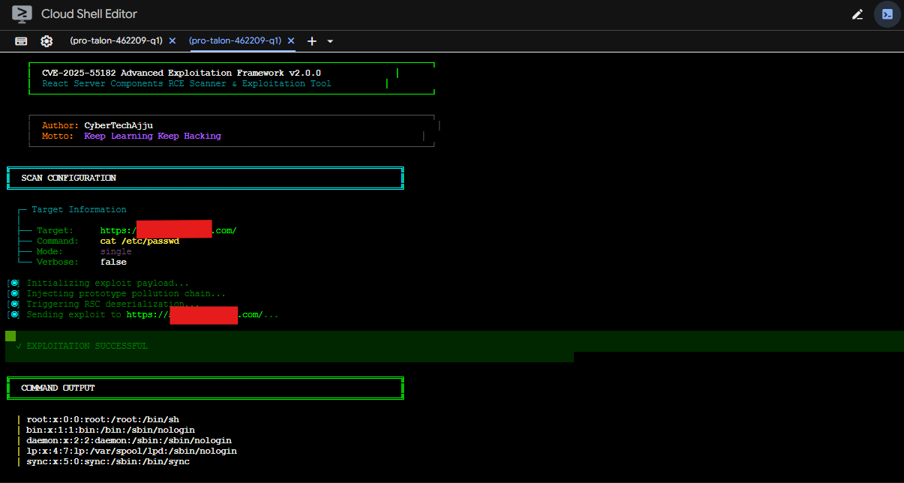

# 🔥React2Shell Toolkit-CVE-2025-55182 & CVE-2025-66478

<div align="center">


[](https://nvd.nist.gov/vuln/detail/CVE-2025-55182)
[](https://nvd.nist.gov/vuln/detail/CVE-2025-66478)
[](https://www.first.org/cvss/)

**🚨 Critical RCE in React Server Components & Next.js 🚨**

*Professional Red Team Toolkit for CVE-2025-55182 Detection & Exploitation*

[🔍 Features](#-features) • [⚡ Quick Start](#-quick-start) • [📚 Documentation](#-documentation) • [🤝 Connect](#-connect-with-me)

</div>

---

## 🎯 About CVE-2025-55182 & CVE-2025-66478

### 🐛 What is React2Shell?

**React2Shell** is a **critical unauthenticated Remote Code Execution (RCE)** vulnerability affecting React Server Components (RSC) and Next.js applications.

| CVE ID | Component | CVSS Score | Impact |
|--------|-----------|------------|--------|
| **CVE-2025-55182** | React Server Components | **10.0** 🔴 | Complete Server Takeover |
| **CVE-2025-66478** | Next.js Server Actions | **10.0** 🔴 | Full System Compromise |

### 🎭 Attack Vector

```javascript
// Attacker sends malicious Flight protocol payload
POST / HTTP/1.1
Next-Action: exploit
Content-Type: multipart/form-data

{"__proto__": "pollution", "then": "gadget_chain"} 
    ↓
Unsafe Deserialization
    ↓
Prototype Pollution
    ↓
💥 Remote Code Execution 💥
```

### 🎯 Affected Versions

- **React**: 19.0.0, 19.1.0, 19.1.1, 19.2.0
- **Next.js**: 15.x, 16.x (with App Router)
- **Frameworks**: React Router, Waku, Vite RSC, Parcel, RedwoodSDK

### ✅ Patched Versions

- **React**: 19.0.1+, 19.1.2+, 19.2.1+
- **Next.js**: 15.0.5+, 15.1.9+, 15.2.6+, 16.0.7+

---

## 📸 Proof of Concept

<div align="center">

### 🎯 Live Exploitation Demonstrations

</div>

<table>
<tr>
<td width="50%" align="center">

**🔓 Successful RCE Exploitation**


*Command execution via React2Shell vulnerability*

</td>
<td width="50%" align="center">

**💥 Vulnerability Confirmation**



*Server compromise through Flight protocol*

</td>
</tr>
</table>

<div align="center">

> ⚠️ **These screenshots demonstrate real exploitation in controlled environments**  
> Use responsibly and only with proper authorization

</div>

---

## 🛠️ Toolkit Components

This repository contains **4 professional-grade tools** for CVE-2025-55182 detection and exploitation:

<table>
<tr>
<td width="25%" align="center">

### 🔍 Nuclei Template
**Advanced Scanner**


✅ 5 Payloads  
✅ Zero False Positives  
✅ Math Validation  
✅ Batch Scanning  

</td>
<td width="25%" align="center">

### 🐍 Shodan Scanner
**Target Discovery**


✅ Automated Search  
✅ Mass Scanning  
✅ 50+ Shodan Queries  
✅ Interactive Wizard  

</td>
<td width="25%" align="center">

### 💻 Bash Exploit
**CLI Framework**


✅ 8 Predefined Payloads  
✅ Interactive Mode  
✅ Multi-Target Support  
✅ Cyberpunk UI  

</td>
<td width="25%" align="center">

### 🔧 Burp Extension
**Manual Testing**


✅ 30+ Payloads  
✅ Active + Passive Scan  
✅ GUI Interface  
✅ Collaborator Integration  

</td>
</tr>
</table>

---

## ⚡ Quick Start

### 📦 Installation

```bash
# Clone the repository
git clone https://github.com/cybertechajju/cve-2025-55182.git
cd cve-2025-55182

# Install Python dependencies
pip install -r requirements.txt
pip install -r exploits/requirements.txt
```

### 🚀 Usage Examples

#### 1️⃣ **Nuclei Scanner** (Fastest Detection)

```bash
# Scan single target
nuclei -t nuclei-templates/cve-2025-55182.yaml -u https://target.com

# Scan multiple targets
nuclei -t nuclei-templates/cve-2025-55182.yaml -l targets.txt
```

#### 2️⃣ **Shodan Scanner** (Mass Discovery)

```bash
# Interactive wizard mode
python exploits/shodan_scanner_advanced.py

# Or with API key directly
python exploits/shodan_scanner_advanced.py --api YOUR_SHODAN_API_KEY
```

#### 3️⃣ **Bash Exploit** (Direct Exploitation)

```bash
# Interactive mode
bash exploits/scanner_advanced.sh -i

# Quick exploitation
bash exploits/scanner_advanced.sh -d https://target.com -p 2
```

#### 4️⃣ **Burp Extension** (Manual Testing)

1. Open Burp Suite → **Extensions** → **Add**
2. Select `burp-extension/React2Shell_Burp.py`
3. Check "React2Shell Pro" tab for GUI

---

## 📁 Repository Structure

```
cve-2025-55182/
├── 📂 nuclei-templates/          # Nuclei YAML templates
│   └── cve-2025-55182.yaml       # Advanced detection template
├── 📂 exploits/                  # Exploitation tools
│   ├── shodan_scanner_advanced.py   # Shodan mass scanner
│   ├── scanner_advanced.sh          # Bash exploitation framework
│   └── requirements.txt             # Python dependencies
├── 📂 burp-extension/            # Burp Suite extension
│   ├── React2Shell_Burp.py       # Main extension (30+ payloads)
│   ├── payloads.json             # Payload library
│   └── detection_rules.json      # Detection patterns
├── 📂 burp bechek/               # BCheck files for Burp Scanner
│   ├── CVE-2025-55182-React2Shell-Active.bcheck
│   └── CVE-2025-66478-NextJS-React2Shell-Active.bcheck
└── 📄 README.md                  # This file
```

---

## 🎨 Features Showcase

### ✨ Nuclei Template Features

- ✅ **5 Exploitation Payloads**: Linux, Windows, alternative endpoints
- ✅ **Mathematical Validation**: `41 * 271 = 11111` (zero false positives)
- ✅ **Multi-Stage Detection**: Framework fingerprinting → RSC discovery → RCE validation
- ✅ **Multiple Matchers**: Math validation, error patterns, execution proof

### 🔥 Shodan Scanner Features

- ✅ **50+ Shodan Queries**: Maximum vulnerable target discovery
- ✅ **Smart Extraction**: Both IPs and domain names
- ✅ **Interactive Wizard**: Guided setup for beginners
- ✅ **Cyberpunk UI**: Neon-themed terminal with animations
- ✅ **Batch Scanning**: Multi-threaded target scanning
- ✅ **JSON Reports**: Detailed vulnerability reports

### 💪 Bash Exploit Features

- ✅ **8 Predefined Payloads**: System info, AWS metadata, container detection, etc.
- ✅ **Interactive Mode**: Menu-driven exploitation
- ✅ **Multi-Target Scanning**: Scan from file list
- ✅ **Rich Output**: Color-coded results with animations
- ✅ **Error Analysis**: Detailed failure diagnostics

### 🚀 Burp Extension Features

- ✅ **30+ Payload Library**: Organized in 5 categories
- ✅ **Dual Scanners**: Passive monitoring + active exploitation
- ✅ **8-Tab GUI**: Dashboard, scanner, exploitation, payloads, results, config, about
- ✅ **Burp Collaborator**: Out-of-band RCE confirmation
- ✅ **Export Options**: JSON and CSV reports
- ✅ **Confidence Scoring**: Certain (95%), Firm (75%), Tentative (50%)

---

## 📚 Documentation

### 📖 Detailed Guides

- [Nuclei Template Usage](nuclei-templates/README.md)
- [Shodan Scanner Guide](exploits/README.md)
- [Burp Extension Manual](burp-extension/README.md)
- [BCheck Documentation](burp%20bechek/README.md)

### 🎓 Learning Resources

- [Understanding React Server Components](https://react.dev/reference/rsc/server-components)
- [Flight Protocol Deep Dive](https://github.com/facebook/react/tree/main/packages/react-server)
- [Prototype Pollution Explained](https://portswigger.net/web-security/prototype-pollution)

---

## ⚠️ Legal & Ethical Disclaimer

```
╔═══════════════════════════════════════════════════════════════╗
║                    ⚠️  CRITICAL WARNING ⚠️                     ║
╚═══════════════════════════════════════════════════════════════╝

This toolkit is for AUTHORIZED SECURITY TESTING ONLY.

⚖️  Legal Use:
   ✅ Penetration testing with written authorization
   ✅ Bug bounty programs within defined scope
   ✅ Security research on owned infrastructure
   ✅ Educational purposes in controlled labs

❌ Illegal Activities:
   ⛔ Unauthorized system access
   ⛔ Malicious exploitation
   ⛔ Data theft or destruction
   ⛔ Deploying malware

By using this toolkit, you agree to use it ethically and legally.
Unauthorized access to computer systems is illegal under:
• Computer Fraud and Abuse Act (CFAA) - USA
• Computer Misuse Act - UK
• Similar laws worldwide

🔒 You are solely responsible for your actions.
```

---

## 🤝 Connect With Me

<div align="center">

### 👨‍💻 **CyberTechAjju**
*Security Researcher • Red Team Specialist • Bug Bounty Hunter*

**Motto:** *Keep Learning Keep Hacking* 🚀

</div>

<table align="center">
<tr>
<td align="center">
<a href="https://github.com/cybertechajju">

</a>
</td>
<td align="center">
<a href="https://instagram.com/cybertechajju">

</a>
</td>
</tr>
<tr>
<td align="center">
<a href="https://linkedin.com/in/ajay-meena-6b432128a">

</a>
</td>
<td align="center">
<a href="https://whatsapp.com/channel/0029VbBo8EwEQIaqX2rolp1P">

</a>
</td>
</tr>
<tr>
<td align="center" colspan="2">
<a href="https://chat.whatsapp.com/CITq9weKNJcH002isEQ5Ka">

</a>
</td>
</tr>
</table>

---

## 🌟 Star History

If this toolkit helped you, please ⭐ star this repository!

[](https://star-history.com/#cybertechajju/cve-2025-55182&Date)

---

## 📝 Credits & Acknowledgments

### 🙏 Special Thanks

- **React Security Team** - For responsible disclosure
- **ProjectDiscovery** - For Nuclei platform
- **PortSwigger** - For Burp Suite
- **Emre Davut** - Original Shodan scanner inspiration
- **Security Research Community** - For CVE analysis and PoCs

### 🏆 Original Research

- [Assetnote React2Shell Scanner](https://github.com/assetnote/react2shell-scanner)
- [Maple3142's PoC](https://gist.github.com/maple3142/48bc9393f45e068cf8c90ab865c0f5f3)
- [React Official Advisory](https://react.dev/blog/2025/01/15/react-19-rsc-security-update)

---

## 📄 License

**For Educational and Authorized Security Testing Only**

No warranty or liability provided. Use at your own risk.

---

<div align="center">

### 💬 Questions or Issues?

Open an [Issue](https://github.com/cybertechajju/cve-2025-55182/issues) or reach out on social media!

**Made with ❤️ by [CyberTechAjju](https://github.com/cybertechajju)**

*Keep Learning. Keep Hacking. Stay Ethical.* 🎯🔐

</div>

