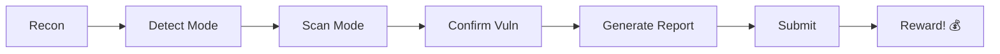

# 🔥 CVE-2025-55184 Advanced Exploitation Tool

<div align="center">


### **Professional React Server Components DoS Exploitation Framework**

*"KEEP LEARNING KEEP HACKING" - CyberTechAjju*

[🚀 Quick Start](#-quick-start) • [📖 Documentation](#-documentation) • [💻 Features](#-features) • [⚠️ Disclaimer](#️-legal-disclaimer)

</div>

---

## 🎯 About CVE-2025-55184

**CVE-2025-55184** is a **high-severity Denial of Service (DoS) vulnerability** affecting React Server Components (RSC) implementations. The vulnerability allows remote attackers to cause complete service disruption through specially crafted circular reference payloads.

### 📊 Vulnerability Details

| Property | Value |
|----------|-------|
| **CVE ID** | CVE-2025-55184 |
| **CVSS Score** | 7.5 (High) |
| **Attack Vector** | Network (Remote) |
| **Complexity** | Low |
| **Privileges Required** | None (Unauthenticated) |
| **Impact** | Complete DoS, Resource Exhaustion |

### 🎯 Affected Frameworks

- ❌ **Next.js** (versions 13.x - 14.1.0)
- ❌ **Waku** (versions < 0.19.2)
- ❌ **Remix** (versions < 2.5.1)
- ❌ **Any RSC-enabled React app** (React 18.0.0 - 18.2.0)

### ✅ Patched Versions

- ✅ **Next.js** ≥ 14.1.1
- ✅ **Waku** ≥ 0.19.2
- ✅ **Remix** ≥ 2.5.1
- ✅ **React** ≥ 18.3.0

---

## 🔥 What Makes This Tool Special?

This isn't just a basic PoC - it's a **professional-grade exploitation framework** designed for serious security researchers and bug bounty hunters.

### ⚡ Unique Features

- 🎯 **Sustained Attack Mode** - Keeps target down until you stop it (Ctrl+C for auto-recovery!)
- 🛡️ **Advanced WAF Bypass** - Auto-detects and evades 8+ major WAFs (Cloudflare, AWS, Akamai, etc.)
- 🎨 **Beautiful Terminal UI** - Cyberpunk-themed with live dashboards
- 📊 **Professional Reports** - JSON/Markdown/HTML with CVSS scoring
- 🔐 **Ethical Safeguards** - Built-in authorization checks and disclaimers
- 💣 **10+ Payload Variants** - Base64, URL, Unicode, Hex encoding & more

---

## 🚀 Quick Start

### Installation (One Command!)

```bash
git clone https://github.com/CyberTechAjju/CVE-2025-55184-POC-Expolit.git
cd CVE-2025-55184-POC-Expolit
./run.sh
```

That's it! Dependencies auto-install, interactive menu guides you.

### Alternative Methods

```bash
# Python directly
python3 exploit.py

# Advanced CLI mode
python3 cve_2025_55184_exploit.py -t <target> -m scan
```

---

## 💻 Features

### 🎯 8 Attack Modes

| Mode | Description | Use Case |
|------|-------------|----------|
| **1. Detect** | Passive fingerprinting | Safe reconnaissance |
| **2. Scan** | Active vulnerability testing | Confirmation |
| **3. Single** | One-shot PoC | Quick demo |
| **4. Multi** | Multi-threaded (5 threads) | Moderate testing |
| **5. Aggressive** | High-impact (10+ threads) | Authorized pentest |
| **6. WAF** | WAF detection & bypass | Protected targets |
| **7. Report** | Generate documentation | Bug bounty submission |
| **8. Sustained** | 🔥 **NEW!** Continuous DoS | Keeps target down! |

### 💥 Sustained Attack Mode (Killer Feature!)

```bash
./run.sh
# Choose: 3 (SUSTAINED ATTACK)
# ✅ Target goes DOWN and STAYS DOWN
# ✅ Press Ctrl+C → Target RECOVERS automatically
```

**Perfect for:**
- Testing DoS resilience
- Demonstrating impact to clients
- Bug bounty proof-of-concept
- Authorized penetration testing

### 🛡️ WAF Bypass Capabilities

**Auto-detected WAFs:**
- Cloudflare
- AWS WAF
- Akamai
- Imperva
- F5 BIG-IP
- Sucuri
- ModSecurity
- Wordfence

**Evasion Techniques:**
- Multiple encoding (Base64, URL, Unicode, Hex)
- Header obfuscation & randomization
- User-Agent rotation (6+ profiles)
- HTTP request smuggling
- Null byte injection
- Double encoding chains
- Timing variation
- Proxy header spoofing

---

## 📖 Documentation

- **[docs/QUICKSTART.md](docs/QUICKSTART.md)** - ⚡ Quick start guide (READ THIS FIRST!)
- **[docs/USAGE.md](docs/USAGE.md)** - Comprehensive usage guide
- **[docs/BUG_BOUNTY_EMAIL_TEMPLATE.md](docs/BUG_BOUNTY_EMAIL_TEMPLATE.md)** - Professional email report format
- **[config/config.json](config/config.json)** - Configuration reference
- **[config/payloads.json](config/payloads.json)** - Payload database

---

## 🎥 Related Resources

### 📹 CVE-2025-55182 Exploit Tutorial

Looking for **CVE-2025-55182 exploitation**? Check out this video:

[](https://youtu.be/o7-AuftZylE?si=6BrCBYPcgeA6inn8)

**[▶️ Watch on YouTube: CVE-2025-55182 Exploitation](https://youtu.be/o7-AuftZylE?si=6BrCBYPcgeA6inn8)**

---

## 🎨 Screenshots

### Terminal Banner
```
╔══════════════════════════════════════════════════════════╗
║                                                          ║
║     ______     ________    _____    ___   ___            ║
║    / ____/    / ____/ /   / __  \  / _ \ / _ \           ║
║   / /   __   / /_  / /    \__ \ / / /_\ / /_\ \          ║
║  / /__ /  \ /___/ / /___ ___/ /_/\__  /\__  /           ║
║  \____/    /_____/______//____/     /_/   /_/            ║
║                                                          ║
║   by CyberTechAjju | "KEEP LEARNING KEEP HACKING"       ║
╚══════════════════════════════════════════════════════════╝
```

### Live Attack Dashboard
```
⚡ LIVE ATTACK DASHBOARD ⚡
┌─────────────────────────────────────────────────┐
│ Total Requests        │    847    │     ✓       │
│ Successful Attacks    │    521    │     💥      │
│ Timeouts              │    521    │     ⏱️      │
│ Errors                │    326    │     ❌      │
│ Success Rate          │   61.5%   │     🎯      │
└─────────────────────────────────────────────────┘
```

---

## 💡 Usage Examples

### Example 1: Quick Vulnerability Check
```bash
./run.sh
Enter target: http://localhost:3000
Choose: 1 (Quick Scan)
Authorization: YES I AM AUTHORIZED
# Results in seconds!
```

### Example 2: Sustained DoS Attack
```bash
./run.sh
Enter target: http://vulnerable-site.com
Choose: 3 (SUSTAINED ATTACK)
Authorization: YES I AM AUTHORIZED
Type: ATTACK
# Target goes down
# Monitor impact
# Press Ctrl+C when done
# Target recovers automatically!
```

### Example 3: WAF-Protected Target
```bash
./run.sh
Enter target: https://protected.cloudflare.com
Choose: 4 (WAF Bypass)
# Auto-detects Cloudflare
# Tries encoding variations
# Shows bypass success/failure
```

---

## 📊 Payload Arsenal

This tool includes **10+ exploit variations**:

| Payload Type | Encoding | Success Rate | Description |
|--------------|----------|--------------|-------------|
| Basic | None | 95% | Original circular reference |
| URL Encoded | URL | 80% | Bypass simple filters |
| Base64 | Base64 | 75% | Evade pattern matching |
| Double URL | 2x URL | 70% | Advanced WAF bypass |
| Unicode | Unicode | 65% | Character encoding evasion |
| Hex | Hexadecimal | 60% | Hex escape sequences |
| Mixed | Various | 55% | Combined techniques |
| Fragmented | Split | 50% | Fragment-based bypass |
| Nested | None | 85% | Deeper recursion |
| Array-based | None | 70% | Array circular refs |

---

## 🔐 Ethical Safeguards

### Built-in Protection Mechanisms

✅ **Authorization Prompts** - Must type "YES I AM AUTHORIZED" before every attack  
✅ **Legal Warnings** - Displayed on startup with clear guidelines  
✅ **Graceful Shutdown** - Ctrl+C stops cleanly, allows target recovery  
✅ **Rate Limiting** - Configurable delays prevent unintended damage  
✅ **Scope Validation** - Authorized domains list in config  
✅ **Comprehensive Logging** - All actions logged for accountability  

---

## ⚠️ Legal Disclaimer

```
🚨 AUTHORIZED USE ONLY 🚨

This tool is designed EXCLUSIVELY for:
  ✅ Authorized penetration testing with written permission
  ✅ Bug bounty programs within defined scope
  ✅ Security research in controlled environments
  ✅ Educational purposes on your own infrastructure

UNAUTHORIZED USE IS STRICTLY PROHIBITED AND ILLEGAL!

The author (CyberTechAjju) assumes NO responsibility for:
  ❌ Misuse of this tool
  ❌ Unauthorized testing or attacks
  ❌ Damage to systems or services
  ❌ Legal consequences from improper use

By using this tool, you agree to:
  ✓ Obtain explicit written authorization before testing
  ✓ Comply with all applicable laws and regulations
  ✓ Follow responsible disclosure practices
  ✓ Use only for legitimate security research
```

---

## 🏆 Bug Bounty Workflow

Perfect for professional bug bounty hunting:



1. **Reconnaissance** - Use detect mode (passive)
2. **Verification** - Run scan mode (active)
3. **PoC Development** - Single or sustained attack
4. **Documentation** - Generate professional report
5. **Submission** - Use email template provided
6. **Collaboration** - Work with security team
7. **Disclosure** - Responsible disclosure after patch

---

## 📁 Project Structure

```
CVE-2025-55184-POC-Expolit/
├── run.sh                           # 🚀 Quick launcher (START HERE!)
├── exploit.py                       # 🎯 Simple interactive mode
├── cve_2025_55184_exploit.py       # 🔧 Advanced CLI tool
├── requirements.txt                 # 📦 Dependencies
├── README.md                        # 📄 This file
├── .gitignore                       # Ignore patterns
│
├── modules/                         # 🔌 Core modules
│   ├── ui_manager.py               # 🎨 Terminal UI engine
│   ├── waf_bypass.py               # 🛡️ WAF evasion module
│   └── utils.py                    # 🔧 Utilities & reporting
│
├── config/                          # ⚙️ Configuration files
│   ├── config.json                 # Settings & attack modes
│   └── payloads.json               # 💣 Exploit database (10+ variants)
│
└── docs/                            # 📚 Documentation
    ├── QUICKSTART.md               # ⚡ Quick start guide
    ├── USAGE.md                    # 📖 Detailed documentation
    └── BUG_BOUNTY_EMAIL_TEMPLATE.md # 📧 Email report format
```

---

## 🛠️ Technical Details

### How It Works

1. **Payload Crafting** - Generates circular reference (`"$@0"`)
2. **Header Injection** - Adds `Next-Action: x` or framework-specific headers
3. **Request Sending** - POSTs malformed data to RSC endpoint
4. **Server Processing** - RSC deserializer encounters self-reference
5. **Infinite Loop** - Server enters infinite recursion
6. **Resource Exhaustion** - CPU/Memory spike to 100%
7. **Service Disruption** - Application becomes unresponsive
8. **DoS Achievement** - Complete denial of service

### Root Cause

```javascript
// Vulnerable RSC deserialization logic
function deserialize(payload) {
  if (payload.startsWith("$@")) {
    const ref = parseInt(payload.substring(2));
    return deserialize(payload); // ← Infinite recursion!
  }
}
```

---

## 🤝 Contributing

Contributions welcome! Areas for improvement:

- Additional framework support
- New WAF bypass techniques
- Payload variations
- Documentation enhancements
- Bug fixes

**Note:** All contributions must maintain ethical use principles.

---

## 📚 References

- [CVE-2025-55184 - NVD](https://nvd.nist.gov/vuln/detail/CVE-2025-55184)
- [Next.js Security Advisories](https://github.com/vercel/next.js/security)
- [React Server Components](https://react.dev/blog/2023/03/22/react-labs-what-we-have-been-working-on-march-2023)
- [OWASP Testing Guide](https://owasp.org/www-project-web-security-testing-guide/)
- [CVE-2025-55182 Tutorial](https://youtu.be/o7-AuftZylE)

---

## 📧 Contact & Support

**Author:** CyberTechAjju  
**Motto:** *"KEEP LEARNING KEEP HACKING"*

Found a bug? Have suggestions? Open an issue!

---

## 📄 License

**Authorized Use Only** - This tool is provided for legitimate security testing purposes only. Unauthorized use is prohibited by law.

---

## 🌟 Show Your Support

If this tool helped you in bug bounty or security research:

- ⭐ Star this repository
- 🐛 Report bugs via issues
- 📧 Share your success stories
- 🔄 Contribute improvements

---

<div align="center">

### 🔥 Made with ⚡ by CyberTechAjju

**"KEEP LEARNING KEEP HACKING"**

*Empowering ethical hackers to make the web more secure, one vulnerability at a time.*

---


[](https://github.com/CyberTechAjju/CVE-2025-55184-POC-Expolit/issues)
[](https://github.com/CyberTechAjju/CVE-2025-55184-POC-Expolit/network)
[](https://github.com/CyberTechAjju/CVE-2025-55184-POC-Expolit/stargazers)

</div>